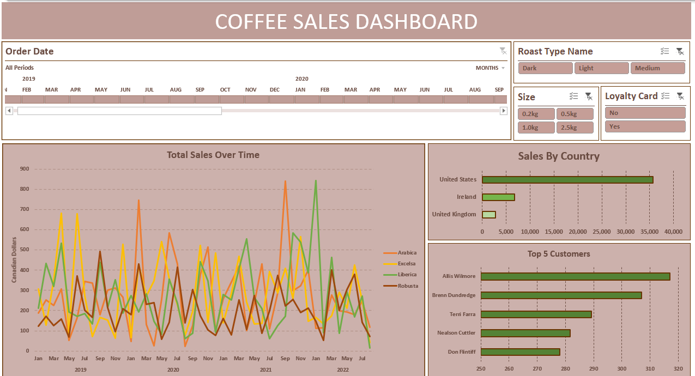

# Sales & Customer Performance Dashboard

This project is a dynamic Excel dashboard built to transform raw sales data into a clean, visual report. Coffee shop owner can see who their Top 5 customers are and track regional performance at a glance.

## Dashboard Preview

## What I Built
I used a mix of data cleaning and advanced formulas to make this dashboard interactive and accurate:

*   **Data Cleaning:** I managed raw sales data by fixing date/number formatting and running duplicate checks.
*   **Dynamic Logic:** I used **XLOOKUP** and **INDEX-MATCH** with absolute references (`$`) to keep the data perfectly aligned and automated.
*   **Interactive filters:** I built the dashboard using **Pivot Tables**, **Slicers**, and **Timeline filters** so users can filter by different coffee types and time periods with just one click.
*   **KPI Tracking:** Created a "Top 5" ranking system to automatically identify high-value customers as well as regional sales.

## Key Insights
*   **Sales Analysis:** A line chart visualizing sales fluctuations across different coffee bean types (Arabica, Excelsa, Liberica, and Robusta) from 2019 to 2022.
*   **Top Performers:** A bar chart clearly identifying the 5 customers driving the most revenue vary by categories.
*   **Regional Trends:** A bar chart visualizing exactly how a region is performing against other regions.

## How to View This Project
1. **Download** the `CoffeeSalesData.xlsx` file from the list above.
2. Open it in **Excel for Desktop** (the web version can sometimes disable the interactive slicers..).
3. Click the **Slicer buttons** on the side to watch the charts update in real-time!!

